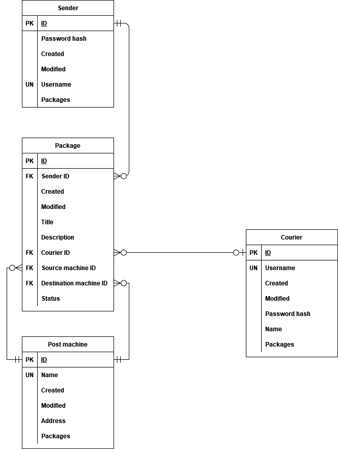

# Shipping service

Sender must have zero or more packages. 
Package must have one and only one sender. 
Package must have zero or one courier. 
Package must have one and only one source machine. 
Package must have one and only one destination machine. 
Post machine must have zero or more packages to hold. 
Courier must have zero or more packages to deliver. 

## System usage story
Peter wants to send a package to Chloe. He signs up to our Shipping service, entering his username and password. The username and password hash is sent to db.
Having signed up, he then registers a shipment to be sent. He enters shipment title, description, picks up a post machine (he picks an address, post machines have unique addresses) from which he wants to send the package (source post machine) and a destination post machine.
After Peter confirms the package registration, system generates a unique link to track the package. Also it generates source and destination post machines’ unlocking codes. The tracking link does not contain the codes (for security reasons), instead the codes are sent to Peter along with the tracking link as a response of shipment registration response. Chloe (package receiver) does not need the account to get a package, instead, Peter sends destination post machine unlocking code and the tracking link to Chloe. The tracking link contains shipment status so Chloe can now there is the package and then it has arrived. Then Chloe (or anybody since links don’t require authentication although are difficult to guess) enters the link, the system checks if there is such one. Since the link starts with shipment ID and since shipment entity contains the link it is easy to verify the links existence. If the link is confirmed to exist, package statuses are sent as a response.
Peter goes to the source post machine, enters its unlocking code and places the package. Once Peter shuts the safe door, it cannot open it again since the unlocking code becomes invalid.
To send a package to the destination machine the need the courier. Courier cannot register himself, instead our team registers him (he must change the password). Courier’s name is William.
Once Peter registration of shipment is uploaded to the db, William can search for new packages to deliver. Since shipments can have no couriers for some time, William is shown a list of these shipments. A source and destination machines’ addresses are shown. If William is willing to deliver the shipment to the endpoint, he can assign it to self. Once William does that, a source and destination machines’ unlocking codes are given. The shipment itself is given a courier and is no longer shown in shipment list for other couriers to consider delivering. William goes to source destination machine, enters the unlocking code and picks up the package. The status of the shipment changes. After some time, William arrives at the endpoint enters destination machine unlocking code and places the package. The status of the shipment changes. Courier cannot unlock the machine once it shuts the doors. William has done his work for this shipment.
Since Peter sent the shipment tracking link to Cloe, she sees that the package has arrived. She goes to the destination post machine and enters the unlocking code Peter has given to her. Chloe takes the package. Shipment status changes. Peter has successfully delivered the package to Chloe.
