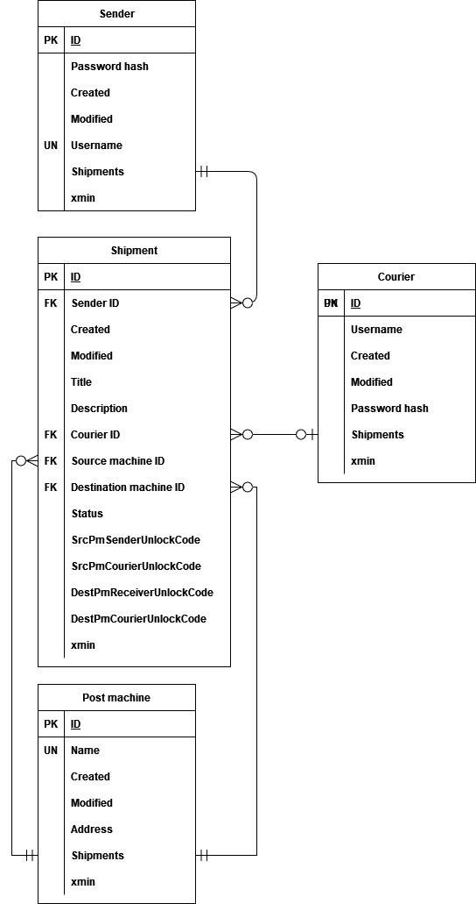

# Shipping service

- Sender must have zero or more packages.
- Package must have one and only one sender.
- Package must have zero or one courier.
- Package must have one and only one source machine.
- Package must have one and only one destination machine.
- Post machine must have zero or more packages to hold.
- Courier must have zero or more packages to deliver.

## System usage story

Peter wants to send a package to Chloe. He signs up to our Shipping service, entering his username and password. The
username and password hash is sent to db.
Having signed up, he logins and then registers a shipment to be sent. He enters shipment title, description, picks up a post
machine (he picks an address, post machines have unique addresses) from which he wants to send the package (source post
machine) and a destination post machine.
After Peter confirms the package registration, system generates a unique link to track the package. Also it generates
source and destination post machines’ unlocking codes [the codes are stored in shipment entity]. The tracking link does not contain the codes (for security
reasons), instead the codes are sent to Peter along with the tracking link as a response of shipment registration.
Chloe (package receiver) does not need the account to get a package, instead, Peter sends destination post machine
unlocking code and the tracking link to Chloe. The tracking link contains shipment status so Chloe can know where the 
package is and when it has arrived. Then Chloe (or anybody since links don’t require authentication although are difficult
to guess) enters the link, the system checks if there is such one. Since the shipment tracking link can be generated 
from the entity's ID the link it is easy to verify the link's existence [link is (shipment ID).concat(shipmentID hash) so no need to store it, can be easily calculated and checked]. If the link is confirmed to exist, package status and destination post machine information are sent as a response.
Peter goes to the source post machine [to the machines page and selects the needed source post machine], enters its unlocking code [the machine checks if one of it's packages has the unlocking code] and places the package [presses place package]. Once Peter shuts the safe door, he cannot open it again since the unlocking code becomes invalid. Shipment status changes. To send a package to the destination machine the courier is needed. Courier can register himself just like the sender. Courier’s name is William.
Once Peter places the shipment inside post machine, the system then generates a new unlocking code for the courier [the codes are stored in shipment entity]. Shipments can have no couriers for some time, William is shown a list of these shipments [the list consists of shipments with status: inSourcePostMachine and which courier is null]. Peter's shipment is one of them. Source and destination
machines’ addresses are of shipments are shown. If William is willing to deliver the shipment to the endpoint, he can assign it to himself (press assign button).
Once William does that, a source and destination machines’ unlocking codes are given. The shipment itself is given a
courier and is no longer shown in shipment list for other couriers to consider delivering. William goes to the source
machine [the page of source machines and selects the needed source machine], enters the unlocking code [the machine checks if one of it's packages has the unlocking code] and picks up the package [pressses pick up package]. The status of the shipment changes. After some time, William arrives at the endpoint [the page of destination machines and selects the needed destination machine] enters destination machine unlocking code [the machine checks if one of it's packages has the unlocking code.] and places the package [presses place package]. The status of
the shipment changes. Courier cannot unlock the machine once it shuts the doors [after the place package button press]. William has done his work for this shipment.
Since Peter sent the shipment tracking link to Chloe, she sees that the package has arrived. She goes to the destination
post machine [the page of destination source machines and selects the needed destination maahine] and enters the unlocking code [the machine checks if one of it's packages has the unlocking code.] Peter has given to her. Chloe takes the package [presses pick up package]. Shipment status changes. Peter has successfully delivered the package to Chloe [the package title and description is shown to Chloe].

## Setting up the database

Database system used is PostgreSQL.

### Linux

1. install postgresql
2. `sudo mkdir /run/postgresql`
3. `sudo chown -R $USER:$USER /run/postgresql`
4. `initdb --locale $LANG -E UTF8 -D ~/postgres/data/`
5. `pg_ctl -D ~/postgres/data -l ~/postgres/logfile start`
6. `createuser -d -P admin` and enter `password` as password

Execute steps 2,3 and 5 on each startup to run the DB.

To delete the database, run `dropdb shipping_service_db`.

If database directory is deleted, steps 2-6 need to be repeated.

### Windows

1. download newest PostgreSQL from https://www.enterprisedb.com/downloads/postgres-postgresql-downloads
2. launch installer
3. select at least "PostgreSQL Server", "pgAdmin4" and "Command Line Tools" in the installer
4. choose user postgres password and remember it, don't change the default port
5. install
5. launch pgAdmin
6. choose pgAdmin password
7. in the servers panel (upper left corner) select first and connect using password from step 4
8. create a new role, named "admin" with password "password" and privileges "Can login" and "Create databases"
9. run the application, the database will be automatically created and will be visible in pgAdmin

Note: on closing, pgAdmin will show message saying that changes might not be saved, just choose leave, everything is ok.

### Database migrations

execute
`dotnet ef migrations add create_db -o Persistence/Migrations`
in project directory
